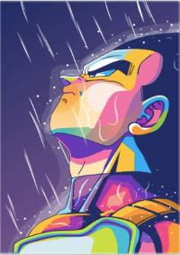

# Tamagotchi

## Description

Inspired by handheld digital pets, this app allows users to control Vegeta by fighting enemies & rediscovering one of the biggest toy fads in the 90s! Users can trigger events by click on the correct buttons displayed. Vegetatamagotchi has three levels, to clear each level and progress throughout the game you must fill each progress bar. Starting at zero for each level you will have to race against time to fill the progress bar. The progress bar will lose one value every time Vegeta yells at you!

## Stack 
This project was made using\


## Code Snippet

### Vegeta Class
```js
class Vegeta {
    constructor(pride, happy, workingOut, isSaiyan, isGod ) {
        this.pride = pride;
        this.happy = happy;
        this.workingOut = workingOut;
        this.isSaiyan = false;
        this.isGod = false;
    }
    default() {
        span.innerHTML = enemies[0]
        videoDiv.innerHTML = videos["saibamen"];
        iframe.src = giphy["default"];
        checkStatus()
    }
    attack() {
        this.prideResult()

        iframe.src = giphy["bba"];
        prideProgressBar.value = this.pride;

        bigBangAttack();
        removeEvent();
        checkStatus();
        setTimeout(() => {
            iframe.src = giphy["default"]
            clickFunction()
        }, 11000)
    }
    prideResult() {
        if (this.happy < 9 || this.workingOut < 9) {
            this.happy += 2
            this.workingOut += 2
        } else {
            this.happy += 1
            this.workingOut += 1
        }

        if (this.happy > 10) {
            this.happy = 10;
        } else if (this.workingOut > 10) {
            this.workingOut = 10;
        }

        this.pride = 2

        prideProgressBar.value = this.pride;
        workoutProgressBar.value = this.workingOut;
        happyProgressBar.value = this.happy;
    }
    sayianPride() {
        this.pride++
        prideProgressBar.value = this.pride;
    }
    happyPlueOne() {
        this.happy++;
        happyProgressBar.value = this.happy;
    }
    workout() {
        this.workingOut++;
        workoutProgressBar.value = this.workingOut;
    }
    adultVegeta() {
        span.innerHTML = enemies[1]

        videoDiv.innerHTML = videos["android19"];

        this.workingOut = 1;
        this.happy = 1;
        this.pride = 1;

        workoutProgressBar.value = this.workingOut;
        happyProgressBar.value = this.happy;
        prideProgressBar.value = this.pride;

        this.isSaiyan = true;
    }
    godVegeta() {
        span.innerHTML = enemies[2]
        videoDiv.innerHTML = videos["goku"];

        this.workingOut = 1;
        this.happy = 1;
        this.pride = 1;

        workoutProgressBar.value = this.workingOut;
        happyProgressBar.value = this.happy;
        prideProgressBar.value = this.pride;

        this.isGod = true;
        setTimeout(() => checkStatus())
    }
    gameIsOver() {
        clearInterval(intervalId)
        document.querySelector('.progress-bar').innerHTML = ''
        document.querySelector('.content').innerHTML = 'Game Over'
        soundBoards = null;
    }
    winner() {
        clearInterval(intervalId);
        document.querySelector('.progress-bar').innerHTML = ''
        document.querySelector('.content').innerHTML = 'You Won!'
        setTimeout(() => princeOfAllSaiyans(), 1000)
    }
}
```


